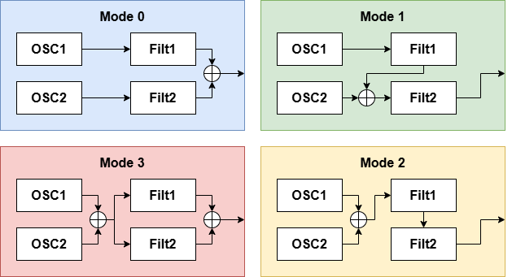
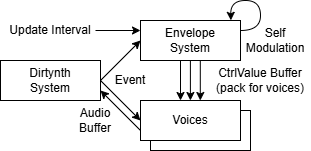

# Dirtynth

注意：README.md使用codex编写，只对项目进展进行客观描述，不代表总体工程形态和发展方向。

注意：此项目未进行电平防护，可能出现音量很大的声音。需要适当降低音量或进行外部电平防护。作者不对任何软件造成的损害负责！

Dirtynth 是一个用 JUCE 写的 MIDI 合成器插件工程。工程已经生成 Visual Studio 2022 项目，当前包含 VST3 和 Standalone 两个构建目标。

声音从 MIDI 事件进入 `DirtynthSystem`，分配到 8 个 voice。每个 voice 有两路波表振荡器、两级可选滤波器、12 个调制槽和一套参数副本。界面直接读写同一份参数结构，宿主状态保存时也写入这份结构。

最近的 git 记录已经推进到 beta v0.1 测试口径：调制源接入、amount 可被调制、包络逻辑重写、mutant 边界修复、comb 增益修正、频移 FM 路径、6 阶椭圆滤波器和 ADSR 算法笔记都已经落进代码或文档。

## 已经做到的部分

- JUCE synth plugin：接收 MIDI 输入，输出音频，提供 VST3 和 Standalone 工程。
- 8 复音 voice 管理：优先复用空闲 voice，再处理已松键 voice，最后循环分配。
- 双波表振荡器：2048 点表，内部生成多层积分表。
- mutant 波表变形：`HardSync`、`SelfPM`、`Kickizer`、`Disperser`。表生成放进 `MutantThreadPool`，音频线程只在表准备好之后换表。
- 双滤波器：`SVF12dB`、`SVF24dB`、`Ellip6order`、`Comb`、`Comb4Stage`、`RSModal`、`Phaser`。
- 四种路由模式：并联、滤波器 1 进滤波器 2、串联、双路混合。
- 12 个调制槽：每个槽有两个 target 和两个 amount；target 直接指向注册过的参数。
- 调制源：ADSR、音高、力度、CC1、CC2 已经接入当前 voice 更新流程。
- ADSR：Attack 从当前值起步，Decay 到 sustain，Release 用 RT60 一阶衰减；参数变化时按当前段位置重算一次值。
- 参数系统：参数描述、显示名、旋钮手感、调制范围和 target 列表统一从 `DirtynthParamSystem` 生成。
- UI：1024x480 单页界面，包含 global、osc、filter、routing、envelope 控制区。
- 状态保存：插件把 `DirtynthParams` 写入宿主 state，并在读取时恢复到引擎。

## 合成路由

## 调制路由

(未按如图实现完整的包络系统)

## 代码入口

- `Source/PluginProcessor.*`：JUCE 宿主桥接、MIDI 收集、状态保存。
- `Source/dsp/DirtySystem.h`：复音、调制、路由、DSP 调度。
- `Source/dsp/DirtyParams.h`：参数结构和参数注册表。
- `Source/dsp/Wavetable.h`：波表振荡器、表生成、mutant 处理。
- `Source/dsp/Filter.h`：滤波器注册表和具体滤波器。
- `Source/dsp/Envelope.h`：ADSR 和调制源。
- `Source/ui/DirtynthUI.h`：插件界面和参数绑定。

## 构建

工程使用 JUCE module 路径 `C:/JUCE/modules`。打开 `Builds/VisualStudio2022/Dirtynth.sln` 后，可以构建 `Dirtynth_VST3` 或 `Dirtynth_StandalonePlugin`。

## 相关笔记

- `blog/02.便宜的数字椭圆滤波器设计/02.便宜的数字椭圆滤波器设计.md`
- `blog/03.高效的ADSR包络算法设计/03final.md`

## 本文未来将替换为人工手写。